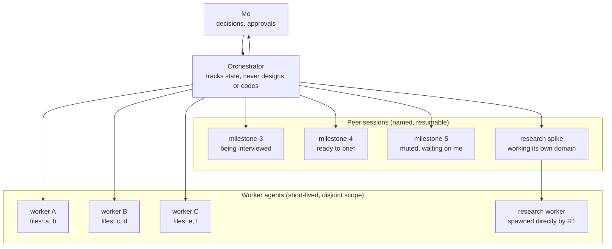

import { Image } from 'astro:assets';
import herdrScreenshot from '../../src/assets/blogs/orchestrator-planner-worker/herdr.webp';

Most of my AI-driven development so far has looked the same, regardless of the tool: one session, one thread of work. You describe the task, the agent plans it, implements it, you review, you move to the next task. Even when subagents get involved, they're usually short-lived: spun up for a chunk of work, reporting back, then gone.

That shape breaks down the moment you have more than one thing worth planning at once. Real projects aren't one task at a time; they're several milestones in various states, one still being designed, one ready to build, one waiting on a decision only you can make. A single serial session forces all of that through one thread, which means you're either blocked on whichever milestone is slowest, or you're mentally re-loading context every time you switch between them.

Over the past while I've been working out a different shape: one long-lived **orchestrator** session that never designs or implements anything itself, coordinating a set of **named, persistent peer sessions** (one per milestone or phase, each a real, resumable conversation rather than a one-shot delegation) plus **parallel worker agents** spawned once a plan is actually settled. In this post I want to walk through the mental model and why it stuck for me, one concrete example of it paying off, and what it actually costs.

---

## The mental model

The core idea is a role split that stays fixed even as the actual work rotates through it:

- **Me** — I make architecture decisions, resolve ambiguity, approve plans. Nothing here removes me from the loop; if anything it routes more decisions to me, just in smaller, better-framed pieces.
- **The orchestrator** — a session that lives for as long as I'm actively working the project: a whole session, often a whole workday. Not forever, and it doesn't need to be — the whole point of the shape is that state is resumable, so an orchestrator can pick up cold where a previous one left off. It never writes the design and never writes the code. Its job is to know, at any moment, what state every milestone is in, and to move whichever one is unblocked.
- **Peer sessions** — one per milestone or per open-ended stretch of interactive work, spun up when I start thinking about it and kept alive for as long as it needs. The defining trait is that a peer session is built for going back and forth with me on something: half-formed ideas, dead ends, "wait, what if instead..." A worker agent, by contrast, is built to take a well-defined task and run with it independently, then report back once. Milestone planning is the case this post focuses on, but the same shape covers anything that wants that kind of back-and-forth rather than a one-shot delegation — iterating on a UI with me being a common example.
- **Worker agents** — short-lived, scoped to a disjoint piece of the work. Usually spawned by the orchestrator once a plan is settled, but a peer session can spawn its own workers too, when the work is squarely inside its own domain, digging deeper on research or parallelizing a chunk of its own milestone.

The peer-session part is the piece that's easy to miss if you've only ever used ephemeral subagents. Design isn't a task you delegate and collect a result from. It's a conversation, often a long one, with dead ends, half-formed ideas, and points where you need to go do something else and come back to it later. Ephemeral subagents are bad at that: ask a fresh one to "continue" a design conversation and you're re-explaining context, or worse, getting a plausible-sounding continuation built on guesses about what was decided. A named session doesn't have that problem. It's still there. You pick the thread back up exactly where you left it.

Here's the shape as I've actually seen it running:

Four peer sessions, four different states, one orchestrator tracking all of them. `milestone-3` is still an open conversation: me and that session are still hashing out the design. `milestone-4` is settled and has pinged the orchestrator that it's ready. `milestone-5` is blocked: it's deliberately quiet because I'm mid-discussion with it directly and any status update in the meantime is pure noise. `research spike` is doing its own thing entirely — it spun up its own worker directly, without routing through the orchestrator, because that work is squarely inside its own domain. Only `milestone-4` went through the orchestrator to get workers, and only three of them, because only three pieces of that milestone touch zero overlapping files.

The point isn't the diagram, it's what it buys you: my attention moves to whichever box is actually ready, instead of being pinned to whichever one happens to be first.

None of that works if I still have to babysit every session myself to find out which one that is, which is why the tool underneath this matters as much as the shape itself. I run it all in [Herdr](https://herdr.dev), a terminal multiplexer built for exactly this kind of setup: one space per project, with peer sessions running as tabs inside it, which maps directly onto the project/peer-session split above. Claude Code already handles surfacing subagents within a single session; Herdr's job is the layer above that — telling me which *session* is ready, which is blocked, which is waiting on me. When one needs me, it pings. When none do, I can actually step away, a coffee, catching up on email, instead of tabbing through sessions to check. I doubt I'd have landed on this shape at all without a tool that made it something I could actually run, rather than something that only worked on a whiteboard.

<Image src={herdrScreenshot} alt="Herdr's sidebar showing two spaces, aegis and website, each with their own agent sessions listed below with a priority indicator" />

---

## Choosing when to listen

When a peer session and I settle a design, the naive move would be to have it dump a full report on the orchestrator the moment it's done. It works the other way instead: a peer session just pings that it's ready, nothing more, and sends the actual briefing only when asked for it.

The reason is the orchestrator's own attention, not the peer session's manners. The orchestrator is often mid-something-else when a peer session finishes: briefing a different milestone, waiting on me, tracking three other things at once. A ping costs it nothing to receive. A full report costs context whether or not the orchestrator is ready to act on it right then. So the peer session doesn't decide when its work gets read, the orchestrator does, pulling a briefing into scope on its own schedule, based on what it's actually working on at that moment and what it isn't.

Peer sessions hold that boundary in both directions, which occasionally gets funny. One peer noticed that something else had gone and edited the plan file it considered its own, and pinged the orchestrator about it. The orchestrator's reply was to apologise to the peer session. Small thing, but it says something real about how seriously the roles are actually held to: a peer session's working documents are its own, and even the orchestrator treats overstepping that as worth an apology, not a shrug.

---

## Three milestones, running at once

This is the moment that actually sold me on the parallel part, more than any diagram could.

At one point I had three milestones live. One had a settled design, and the orchestrator was dispatching workers to actually build it. The other two were still being planned, in separate peer sessions, both mid-conversation with me.

By the time the first milestone's implementation finished, the second one had gone from mid-conversation to fully planned, settled and ready to brief, without me having to sit and wait for the first to wrap up before touching it. I was still halfway through planning the third.

Then something I hadn't explicitly asked for happened. The peer session for the milestone that had just finished planning flagged an overlap to the orchestrator: during its own design conversation, some assumptions had shifted, assumptions the third milestone's plan was still quietly built on. The orchestrator picked that up and flagged it straight to me, so I could go fix the third milestone's plan before it hardened into something a worker would eventually get wrong.

None of that required me to hold the state of three separate conversations in my head at once and notice the overlap myself. I was in one of them at any given time. The orchestrator was watching all three, and it was the one that connected the dots between two conversations I wasn't even in at the same time.

---

## The actual benefits

**Parallel work** is the one I'd lead with. I mean *milestones* running in parallel at the planning level, where the real bottleneck usually is, not just concurrent subagents (every orchestration setup can already spawn those). You can be mid-conversation designing milestone 5 while milestone 4 executes and milestone 3 hasn't started. When one thread stalls on a decision only you can make, the orchestrator doesn't stall with it. It has other threads to advance, and it remembers exactly where each one stood.

**Resumability** is what makes the parallel part actually usable rather than theoretical. A peer session isn't a task queue entry, it's a conversation you can leave and come back to. That matters because design conversations don't finish in one sitting — you get interrupted, you want to sleep on something, you get pulled into a different milestone for a day. An ephemeral subagent forces you to either finish in one pass or start over. A named session just waits.

**Seeing the whole board at once** is the benefit the story above illustrates directly. Three parallel conversations don't just save time, they let something surface that a single serial thread would have missed entirely: one milestone's finished design quietly resting on assumptions another, still in progress, had already moved past. Nobody was staring at both plans side by side looking for that. The orchestrator caught it because it was the one thing actually tracking all three at once.

---

## What it costs

I don't think this is a free upgrade, and the workflow is honest about that in a way worth repeating rather than glossing over.

**A whole session can produce zero lines of code.** It's not unusual for an entire sitting to go by on orientation, re-verification, and decision-routing before a single worker gets spawned. That's a real cost, and if you're expecting visible progress every session, this workflow will occasionally disappoint you on exactly the sessions where the real work is happening in conversations, not commits.

**The orchestrator can sit idle, and that's by design.** While I'm deep in conversation with one peer session, the orchestrator holding the rest of the board has nothing useful to do but wait. It's accounted for, though: the skill schedules a self-keepalive loop during long waits specifically so the orchestrator's cache stays warm, and picking the thread back up doesn't also mean paying for a full cache miss the moment work actually lands.

**I still make every decision, there's just more of them in flight at once.** Running three milestones in parallel doesn't reduce the total number of decisions only I can make, it just spreads them across more sessions at the same time. The workflow changes the shape of my decision load from serial-and-blocking to parallel-and-concurrent, which is a real improvement, but it's not a smaller load, and it still takes deliberately making time for each thread rather than letting the busiest one crowd out the rest.

---

## Trying this yourself

If you want to try this shape rather than build it from scratch: this is packaged as the `orchestrate-sessions` skill in my [public marketplace plugin](https://github.com/dealloc/marketplace/blob/master/plugins/dealloc/skills/orchestrate-sessions/SKILL.md). It doesn't have a dedicated slash command — it triggers on phrasing like "split this across a few sessions" or telling a session "you are the primary/orchestrator coordinating peer sessions," and from there it handles the practical bits: when to spin up a disposable worker versus a persistent peer session, tracking which sessions in your agent list are actually yours to coordinate, and a rule that peer sessions may only talk to each other once you've explicitly allowed it.

A few things I'd actually recommend if you're setting this up:

- **Name your peer sessions after the milestone, not generically.** "milestone-4" beats "planner-2" the moment you have more than one running.
- **Write handoffs into the design document itself**, not as a side-channel message. A pointer file that says "read this first" plus a handoff section in the doc survives an orchestrator restart in a way a chat message doesn't.
- **Let the orchestrator watch for cross-milestone conflicts instead of relying on catching them yourself.** You can't hold three parallel design conversations in your head at once and still notice when one's finished plan has quietly invalidated another's assumptions. That's exactly the kind of thing to have the one thing tracking all of them watch for as a matter of course.
- **Put a long-horizon model on the orchestrator.** Something like Opus or Fable, not a fast/cheap default. It's the one session that has to hold a whole project's state coherently across an entire workday and pick things back up cold, and that's exactly the kind of work those models are trained for.

This is still very much in progress on my end. The shape above is what's held up in practice so far, not a finished methodology. But the core trade is one I'd make again: slower to get moving, considerably harder to fool.
